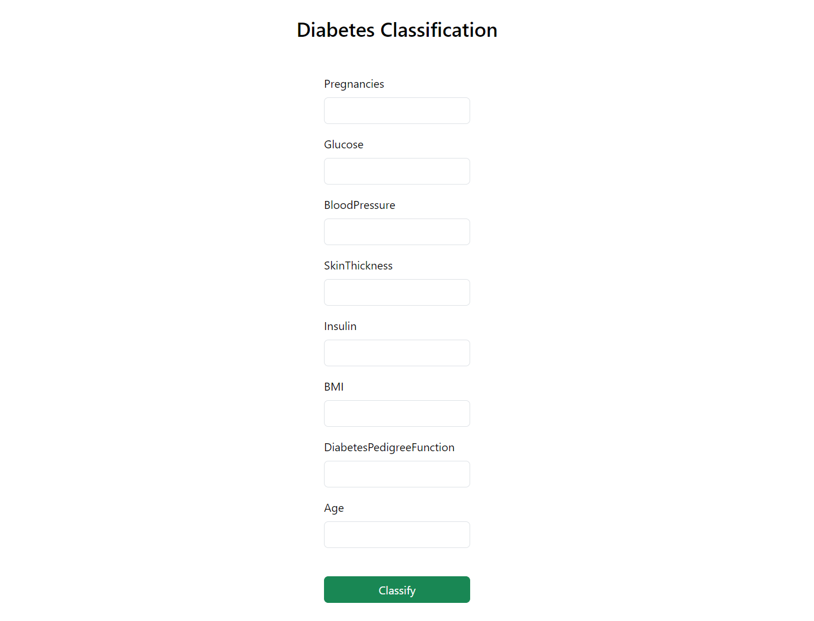

## Classification | Logistic Regression

Dataset - https://www.kaggle.com/datasets/kandij/diabetes-dataset/data

Variables in dataset:
- <b>Pregnancies</b>
- <b>Glucose</b>
- <b>Blood Pressure</b>
- <b>Skin Thickness</b>
- <b>Insulin</b>
- <b>BMI</b>
- <b>Diabetes Pedigree Function</b>
- <b>Age</b>

Web App

